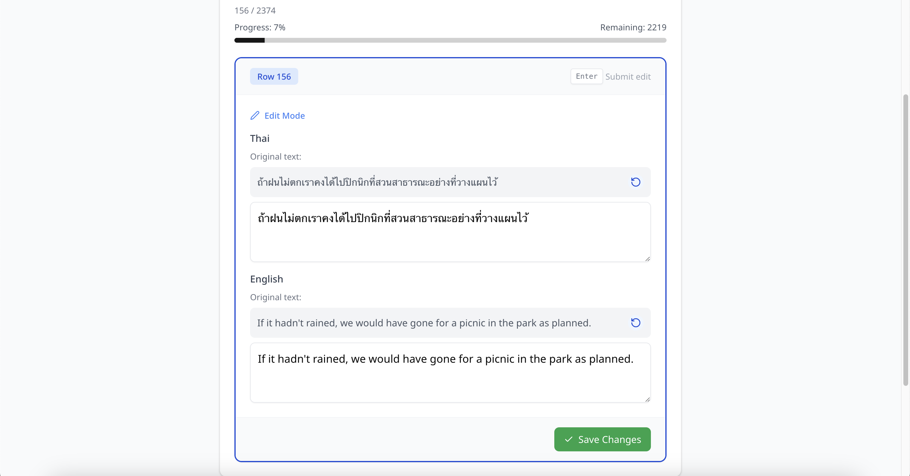
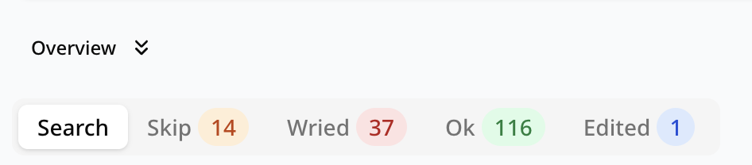
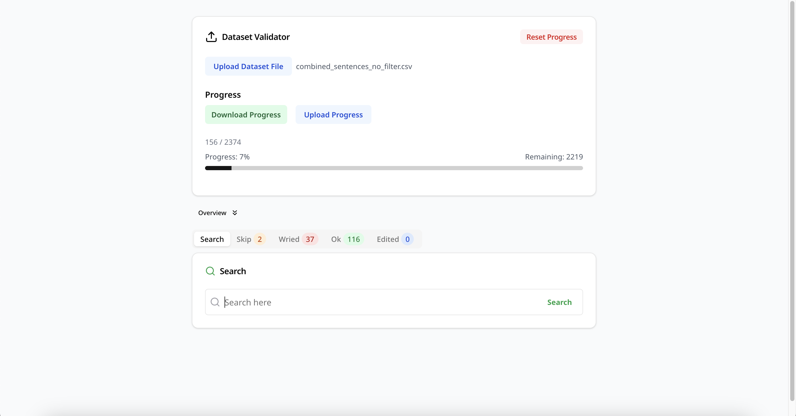
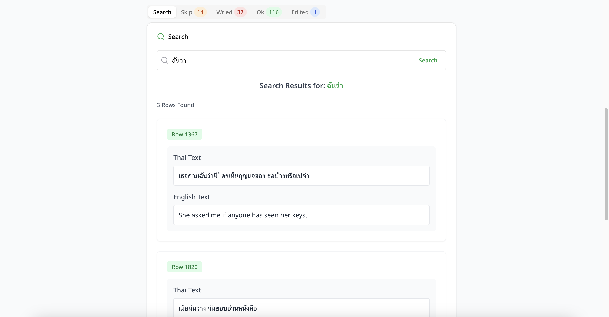
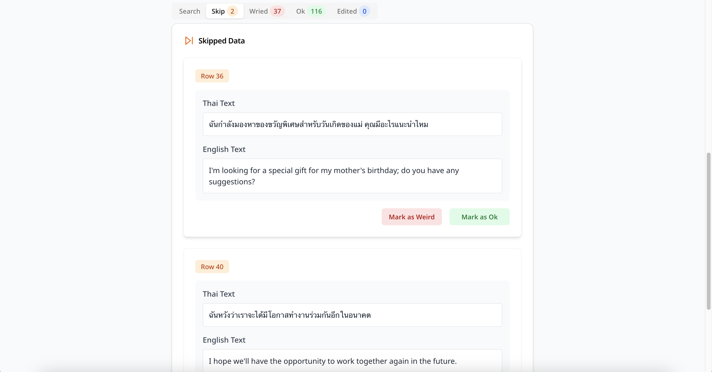
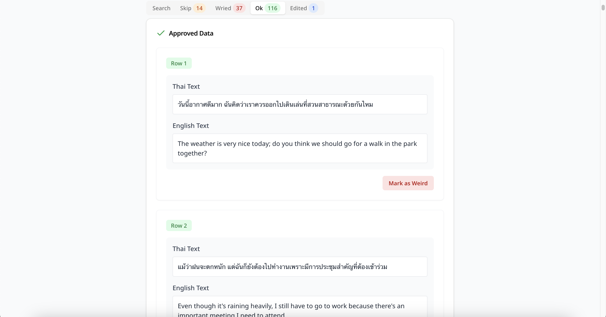
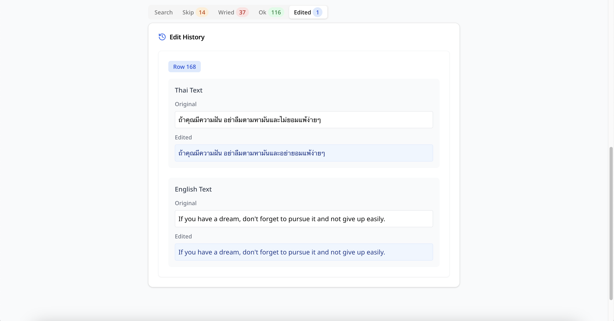

# Dataset Validation Helper

[](https://dataset-validate-helper.vercel.app/)

## About The Project

Dataset Validation Helper is a tool designed to assist users in validating datasets by providing an intuitive interface for reviewing and marking data entries. This project is particularly useful for manually validating machine learning datasets.

## Tech Stack

- **Package Manager**: Bun
- **Frontend**: Next.js, React, TypeScript
- **Styling**: TailwindCSS
- **UI Components**: ShadCN, Radix UI
- **Parsing**: PapaParse

## Structure

```
├── public/
│   ├── file.svg
│   ├── globe.svg
│   ├── next.svg
│   ├── vercel.svg
│   └── window.svg
├── src/
│   ├── app/
│   │   └── page.tsx       # Homepage
│   ├── components/
│   │   ├── ui/            # ShadCN Components
│   │   ├── DataRow.tsx
│   │   └── FileUploadButton.tsx
│   ├── lib/
│   │   └── utils.ts       # Utility functions
│   ├── types/
│   │   └── validation.ts  # Type
│   ├── utils/
│   │   └── parseCsv.ts    # CSV parsing utility
```

## Features

- Upload and parse CSV files
- Validate dataset entries manually
- Save and load validation progress
- User-friendly UI with keyboard shortcuts for efficient marking
- Export validation progress for send the progress to other user or using in **DataSpliter**

## Key Updates

- **Edit file feature:** Allows users to edit dataset entries, with changes recorded in progress.

- **Change status without going back:** Users can update the status of an entry without navigating back.

- **Searchable:** Enables users to search for specific dataset entries efficiently.
- **Update UI:** Improve the UI to make it more readable and easier to use.

### How to Use the Web

1. **Import the dataset:** Upload a CSV file to begin the validation process.
   - CSV field header must be `thai sentence,english sentence`
2. **Mark the data:**
   - Press `Space` to mark data as **Good**.
   - Press `W` to mark data as **Weird**.
   - Press `<-` to **undo** the last action.
   - Press `->` to **skip** the current entry.
3. **Auto-save progress:** The progress is automatically saved in local storage using the dataset filename as the key. If the dataset filename changes, the history will not load. If you upload the dataset file and the progress for that dataset exists, it will automatically load the progress to allow you to continue where you left off.
4. **Download & Share Progress:** You can download your progress and share it with other users, allowing them to continue from where you left off. The saved progress can also be used in **DataSpliter** for further processing.
5. **Reset Progress:** You can reset the progress (current file) by pressing reset progress button.
6. **Edit dataset:** Press `Enter` or click the entry to switch to edit dataset mode. After you finish editing, press `Enter` or click the `Save Change` button to save your edits. You can explore your modified dataset in the Overview section below the entry.
7. **Overview Section:** You can hide or display the Overview section by clicking the toggle button. The tabs will show the amount of data statuses.
8. **Seaech Data:** You can search for data in the search section (within the Overview section). To search, press the search button or press `Enter`, and the results will appear below the section.
9. **Change status:** You can change the status in the Overview section. Click the status to update it.

## Screenshots

### Landing Page


### Uploaded Data


### Edit Data



## Overview Tabs



### Search Data




### Data status overview





### Edit Data Overview



### Validation Finised


## Notes

- Ensure the uploaded CSV file is correctly formatted.
- After finishing editing, the system will automatically detect end-sentence symbols such as `.` ,`!` and `?`. If the edited data ends with nothing, the web will add `.` at the end.
- Progress is saved in your browser's local storage using the dataset filename as the key, tied to your browser profile and device. Switching devices or clearing cache may result in data loss. To prevent this, exporting progress for backup is recommended.
